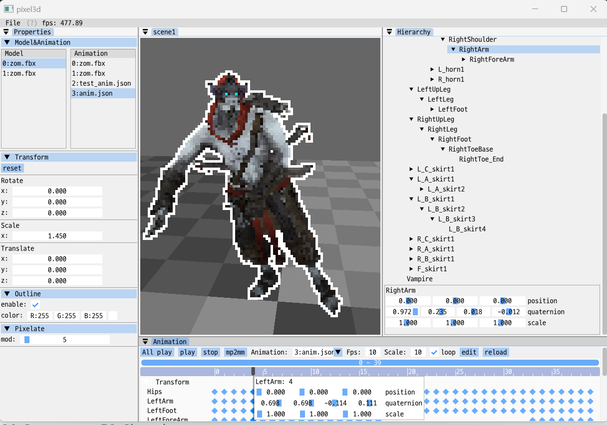

# **Pixel3D v0.0.5**



## **TODO**

-   Fix [#6](https://github.com/Nor-s/Pixel3D/issues/6)
-   model picking
-   visualize bone
-   z oder (grid <-> model)
-   mp2mm: increased accuracy

## **build**

-   windows: MSVC 19.33.31517.0
-   ubunt(wsl2): gcc 9.4.0 x86_64-linux-gnu
-   mac os: Clang 13.0.0 arm64-apple-darwin21.2.0

```
 mkdir build
 cd build
 cmake .. -G Ninja
 Ninja
```

### mp2mm python module (mp_gui_build.yaml)

```
conda env create -f mp_gui_build.yaml
```

-   pyqt5
-   mediapipe
-   pafy
-   pyglm
-   youtube-dl==2020.12.2
-   pyinstaller

## **External**

-   glad: https://glad.dav1d.de/

-   GLFW: https://www.glfw.org/

-   GLM: https://glm.g-truc.net/0.9.9/index.html

-   Assimp: https://github.com/assimp/assimp

-   ImGUI: https://github.com/ocornut/imgui

    -   timeline: https://gitlab.com/GroGy/im-neo-sequencer
    -   text editor: https://github.com/BalazsJako/ImGuiColorTextEdit
    -   dialog: https://github.com/dfranx/ImFileDialog

-   stb: https://github.com/nothings/stb

-   nfd(extended): https://github.com/btzy/nativefiledialog-extended

-   jsoncpp: https://github.com/open-source-parsers/jsoncpp

## **Reference**

-   [learnopengl](https://learnopengl.com/)

-   [texture to file](https://stackoverflow.com/questions/11863416/read-texture-bytes-with-glreadpixels)

-   [pixelate shader](https://github.com/genekogan/Processing-Shader-Examples/blob/master/TextureShaders/data/pixelate.glsl)

-   [skeleton animation: ogldev](https://ogldev.org/www/tutorial38/tutorial38.html)

-   [grid shader 1](http://asliceofrendering.com/scene%20helper/2020/01/05/InfiniteGrid/)

-   [grid shader 2](https://github.com/martin-pr/possumwood/wiki/Infinite-ground-plane-using-GLSL-shaders)

-   [blur shader](https://www.shadertoy.com/view/Xltfzj)

### **Resources**

-   model: https://www.mixamo.com/#/?page=1&type=Character
    -   https://github.com/JoeyDeVries/LearnOpenGL/tree/master/resources/objects
-   font: https://github.com/naver/d2codingfont/wiki/Open-Font-License
-   skybox: https://www.cleanpng.com/free/skybox.html
    -   https://opengameart.org/content/forest-skyboxes
    -   https://www.humus.name/index.php?page=Textures
