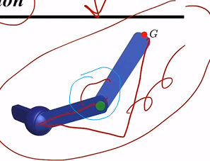
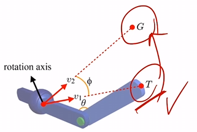
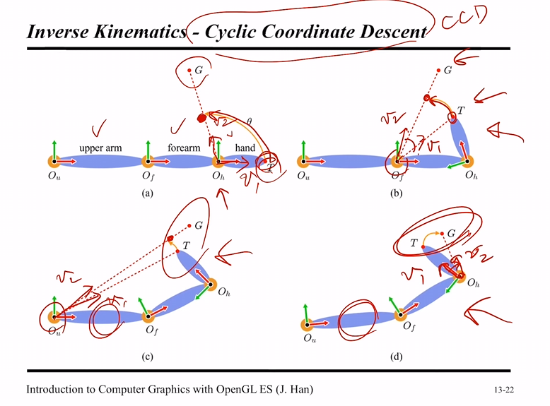

# IK

참고: https://www.youtube.com/watch?v=aZcrHIDO5zY&t=5668s

엔드 이펙터의 위치를 목표 지점까지 이동시키려고할 때
관절들의 회전을 어떻게 해야할지를 결정하는 문제

@자유도

- 어떤 물체의 상태를 정의할때 필요한 최소한의 독립 변수의 개수
  - eg. 경첩: 1자유도, 어깨: 3자유도(roll, pitch, yaw)
    - pitch, yaw 는 방향, roll 은 회전

## Analytic Solution

- 관절체에 회전을 적용
- 목표: 엔드 이펙터 T, 목표 G
  - 관절들을 회전 시켜서 최대한 T를 G에 가깝게 만드는 것
- 회전을 어떻게 정의할 것인가?
- 해석적인 기법
- 방정식을 풀어 정확한 솔루션을 내는 것이 Analytic Solution
- 계산 방식

  - 
  - 길이가 고정이면 위 상황에서 각도는 유일함
  - 코사인 법칙 삼각형을 그려서 각도를 구함
  - 
  - 회전 축을 중심으로 T를 G에 맞춤 (아크볼)
    - v1 을 v2에 일치시키는것 = 각도 필요, 회전 축 필요
    - dot product => 각도 스칼라값
    - cross product => 회전축

- 관절이 많아지면.. 이 방법을 사용하기 어려움

## CCD

end effector 끝점 T 를 G에 일치하고 싶음

- iterative 하게 문제를 해결
- 최하단 부터 회전을 적용함

위와 같은 상황일 때... T를 G
