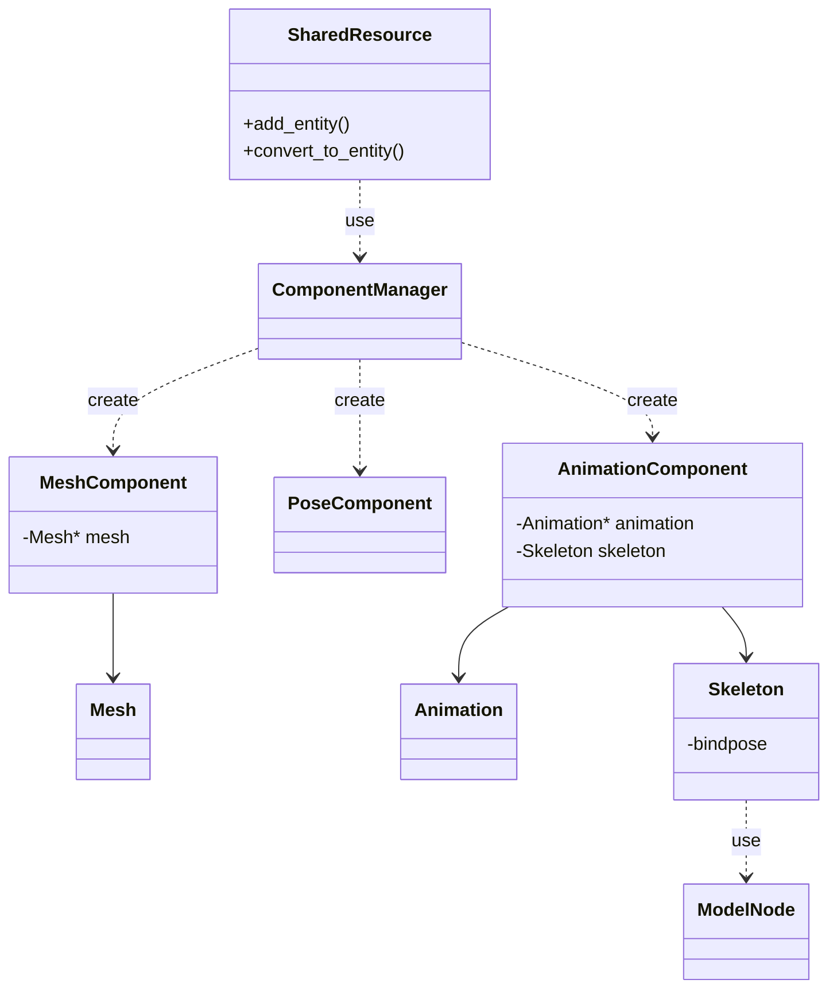

# v0.1.1 :  Import, Entity, Component

## Import - Model

- Import 클래스에서는 `Model`과 `Animation` 을 생성한다.
  - `Model`: `Mesh` 와 같은 정보를 포함하고 모델의 계층 구조를 나타내는 `ModelNode` 에 대한 정보
  - `Animation`: `바인딩 포즈 정보` 와 `바인딩 포즈에 상대적인 변환`, `프레임` 등 에 대한 정보  

## SharedResource - Import

- `SharedResource` 는 `Import` 인스턴스를 사용하여 모델, 애니메이션 리소스를 `Entity` 클래스로 관리한다.

## Entity

## Entity and Component

## Components

### PoseComponent

